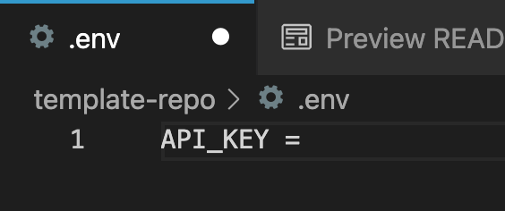

# Giphy Grabber

#### Search Giphy for interesting GIFs

#### By _**Mekinsie Callahan, Jo Miller, and Tyler Sinks**_

## Technologies Used

* _CSS_
* _HTML5_
* _Bootstrap_
* _JavaScript_
* _jQuery_

## Description
Users can search Giphy for interesting GIF to add to whatever they choose.

## Setup/Installation Requirements

**How to Get My Own API Key at GIPHY**
1. Navigate to https://developers.giphy.com/
2. Click the blue Get Started button.
3. Click the blue "Create an App" button in the top right corner of the page.
4. Create an account or login if you're already a Giphy user.
5. Click the "Create an App" button again and complete the brief form.
6. Navigate to your dashboard by hovering over your username in the top right corner, where a dropdown menu will appear. 
7. On your dashboard you will see the API key (it's the 32 character alphanumeric) in a grey-background box. Save this key in a file called ".env" and type the following into it: API_KEY = [your API key without brackets]. No quotes or apostrophes here.


Note: You need to have git and npm already installed to setup and install.

**Download the repo:**
1. Go to https://github.com/sinkstyt/get-gifs
2. Navigate to and click the green  button on middle upper right part of webpage.
3. Click on "Download ZIP"
4. Navigate to the downloaded zip and open it.
5. Open the folder inside the zip.
6. Follow steps 6-8 below.

**Clone the repo:**
1. Go to https://github.com/sinkstyt/get-gifs
2. Navigate to and click the green  button on middle upper right part of webpage.
3. Copy the HTTPs address to your clipboard.
4. Open terminal or bash and navigate to the directory you wish to download the repo to.
5. Once you have chosen your desired directory, open your terminal, type "git clone [paste link]" and press enter:
```bash 
$ git clone https://github.com/sinkstyt/get-gifs
```
6. To open the folder in your default code editor, navigate to the downloaded folder and type "code ." into your terminal:
``` bash
$ code .
```
7. Type "npm install" into the terminal to download the node modules folder and its corresponding dependencies. 
``` bash
$ npm install
```

## Known Bugs

* _No known Bugs_

## License
_GPL_

Copyright (c) 2021 **_Mekinsie Callahan, Jo Miller, Tyler Sinks_**

## Contact Information
* Reach Mekinsie: via <a href="https://www.linkedin.com/in/mekinsie/" target="_blank">Linkedin</a> or <a href="mailto:mekinsie.aja@gmail.com" target="_blank">email</a>. Checkout Mekinsie's <a href="https://github.com/mekinsie" target="_blank">GitHub profile</a>.</li>

* Reach Tyler: via <a href="https://www.linkedin.com/in/tyler-sinks-93438137/" target="_blank">LinkedIn</a> or <a href="mailto:tyler.sinksa@gmail.com" target="_blank">email</a>. Checkout Tyler's <a href="https://github.com/sinkstyt" target="_blank">GitHub profile</a>.</li>


* Reach Jo: via <a href="https://www.linkedin.com/in/jomillerde/" target="_blank">LinkedIn</a> or <a href="mailto:joannadawnmiller@gmail.com" target="_blank">email</a>. Checkout Jo's <a href="https://github.com/joanna-miller" target="_blank">GitHub profile</a>.</li>